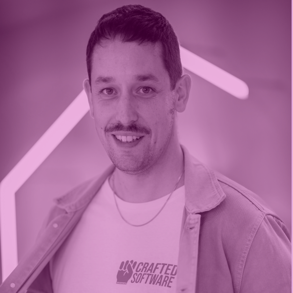
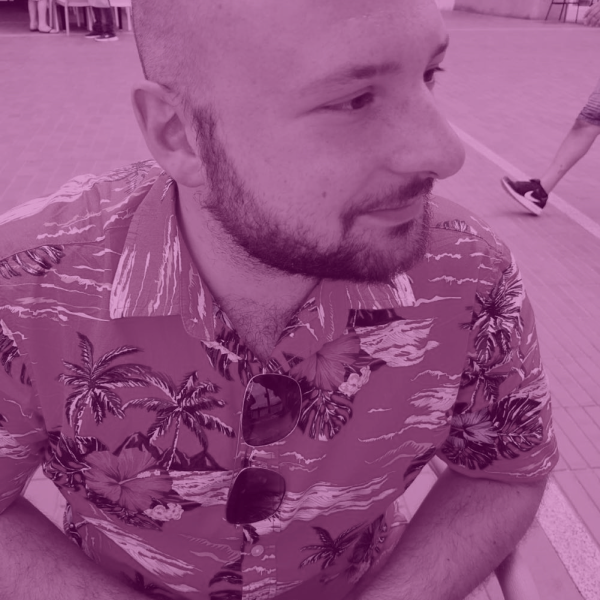

# Mentors

Mentor e mentee possono avere un legame molto importante e duraturo, anche dopo la conclusione del bootcamp. 
Cliccando sull'immagine di ogni mentor sarà possibile accedere al relativo profilo LinkedIn.

## Ludovico Besana 

## Stefania Bottari

## Angelo Giuffredi

## Elisa Bordoli

## Luca Napoletano

## Lisa Zhou

## Giuseppe Delle Donne

## Attilio Capocchiani

