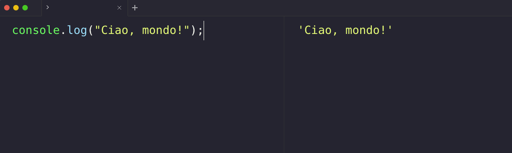

# Introduzione pratica a JavaScript

JavaScript è un linguaggio di programmazione dinamico utilizzato principalmente per la creazione di applicazioni web interattive. 

È stato creato da [Brendan Eich](https://it.wikipedia.org/wiki/Brendan_Eich) nel 1995 e viene utilizzato da milioni di sviluppatori in tutto il mondo.

JavaScript è importante per la creazione di applicazioni web poiché consente di creare interazioni dinamiche con l'utente. Ad esempio, puoi utilizzare JavaScript per creare pulsanti che cambiano colore quando l'utente passa il mouse sopra di essi o per creare formulari che validano automaticamente le informazioni inserite dall'utente.

Per iniziare a programmare in JavaScript, hai bisogno di un ambiente di sviluppo. Ci sono molti editor di testo disponibili, ma ti consigliamo di utilizzare [Visual Studio Code](https://code.visualstudio.com/), che è gratuito e molto potente.

Per eseguire il codice JavaScript, utilizzeremo [RunJS](https://runjs.app/), un'interfaccia utente grafica che ti consente di inserire ed eseguire codice JavaScript in un ambiente isolato. RunJS ti consente di testare il tuo codice in tempo reale e di vedere i risultati immediatamente.

Ecco un esempio di codice JavaScript che puoi inserire in RunJS per testare il tuo ambiente di sviluppo:

```jsx
// questo è un commento, viene ignorato dal programma
// Qui sotto utilizziamo la funzione console.log per stampare il messaggio "Ciao, mondo!" nella console
console.log("Ciao, mondo!"); 
```

Per eseguire il codice sopra in RunJS, segui questi passaggi:

1. Apri RunJS
2. Inserisci il codice sopra nella finestra di sinistra (chiamata "Editor").
3. Nella finestra di destra (chiamata "Console"), vedrai il messaggio "Ciao, mondo!" stampato.



**Congratulazioni! 🎉** 

Hai appena eseguito il tuo primo codice JavaScript utilizzando RunJS. 
