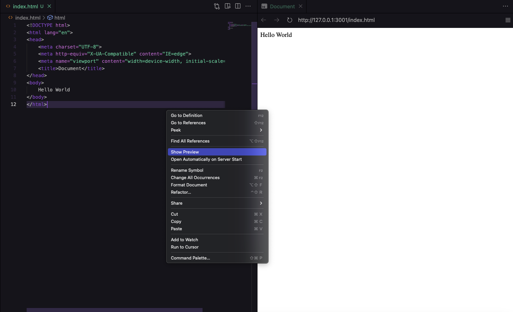

# Live Preview

## Installa Live Preview 

**Step 1:** Apri Visual Studio Code sul tuo computer.

**Step 2:** Nella barra laterale sinistra, trova l'icona delle estensioni (simbolo a forma di quadratino con degli angoli arrotondati) e fai clic su di essa.

**Step 3:** Nella barra di ricerca in alto, digita "Live Preview" e premi il tasto Invio. Dovrebbe apparirti il plugin "Live Preview" tra i risultati di ricerca.

**Step 4:** Clicca sul pulsante "Install" accanto al plugin "Live Preview". Visual Studio Code inizierà a scaricare e installare il plugin.

**Step 5:** Dopo aver completato l'installazione, Visual Studio Code ti chiederà di riavviare il programma. Fai clic su "Restart" per riavviare Visual Studio Code.

**Step 6:** Dopo il riavvio di Visual Studio Code, apri il file HTML che desideri visualizzare in anteprima in tempo reale. Fai clic con il pulsante destro del mouse sul file HTML e seleziona "Open with Live Preview". Dovrebbe aprirsi una finestra con la visualizzazione in anteprima del tuo file HTML.

**Ben fatto! 🎉** 

Ora puoi visualizzare in tempo reale le modifiche apportate ai tuoi file HTML senza dover salvare e ricaricare continuamente la pagina.

