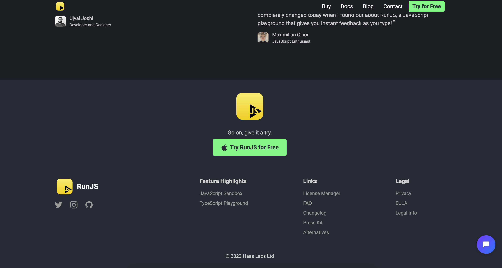
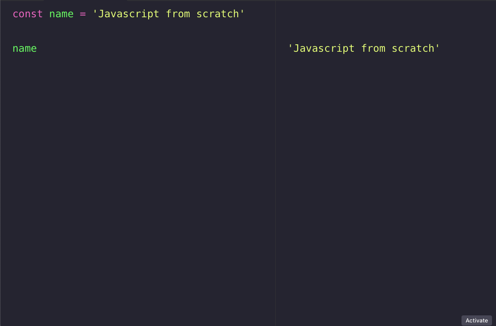

# RunJS

RunJS è uno strumento potente e flessibile per gli sviluppatori JavaScript, che consente loro di scrivere, eseguire e testare il codice JavaScript in un ambiente di sviluppo completo e isolato.

## Per Windows

**Step 1:** Vai al sito web ufficiale di RunJS all'indirizzo https://runjs.dev/.

**Step 2:** Raggiungi il footer del sito e clicca il bottone "Try RunJS for Free" per scaricare l'installer di RunJS per Windows.

**Step 3:** Apri l'installer appena scaricato e segui le istruzioni per completare l'installazione.

**Step 4:** Dopo aver completato l'installazione, apri RunJS dal menu Start o cercando "RunJS" nella barra di ricerca di Windows.

## Per Mac

**Step 1:** Vai al sito web ufficiale di RunJS all'indirizzo https://runjs.dev/.

**Step 2:** Raggiungi il footer del sito e clicca il bottone "Try RunJS for Free" per scaricare il pacchetto di RunJS per Mac.

**Step 3:** Apri il pacchetto appena scaricato e trascina l'icona di RunJS nella cartella "Applicazioni" per completare l'installazione.

**Step 4:** Dopo aver completato l'installazione, apri RunJS dalla cartella "Applicazioni" o dalla barra delle applicazioni di macOS.

**Ben fatto! 🎉**

Ora puoi iniziare ad utilizzare RunJS.

