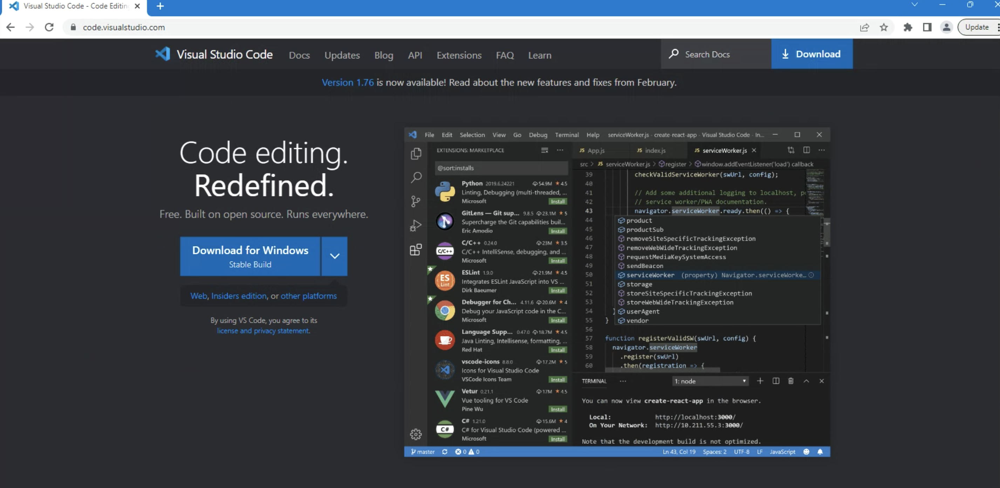
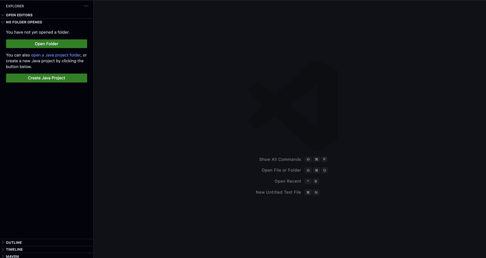

# Visual studio code

VSCode è un editor di codice sorgente sviluppato da Microsoft che supporta una vasta gamma di linguaggi di programmazione.

## Per Windows

**Step 1:** Vai al sito web ufficiale di Visual Studio Code all'indirizzo https://code.visualstudio.com/.

**Step 2:** Clicca sul pulsante "Download for Windows" per scaricare l'installer di Visual Studio Code per Windows.

**Step 3:** Apri l'installer appena scaricato e segui le istruzioni per completare l'installazione.

**Step 4:** Dopo aver completato l'installazione, apri Visual Studio Code dal menu Start o cercando "Visual Studio Code" nella barra di ricerca di Windows.

## Per Mac

**Step 1:** Vai al sito web ufficiale di Visual Studio Code all'indirizzo https://code.visualstudio.com/.

**Step 2:** Clicca sul pulsante "Download Mac Universal" per scaricare l'installer di Visual Studio Code per Mac.

**Step 3:** Apri il pacchetto appena scaricato e trascina l'icona di Visual Studio Code nella cartella "Applicazioni" per completare l'installazione.

**Step 4:** Dopo aver completato l'installazione, apri Visual Studio Code dalla cartella "Applicazioni" o dalla barra delle applicazioni di macOS.

**Ben fatto! 🎉**

Ora puoi iniziare ad utilizzare Visual Studio Code.

